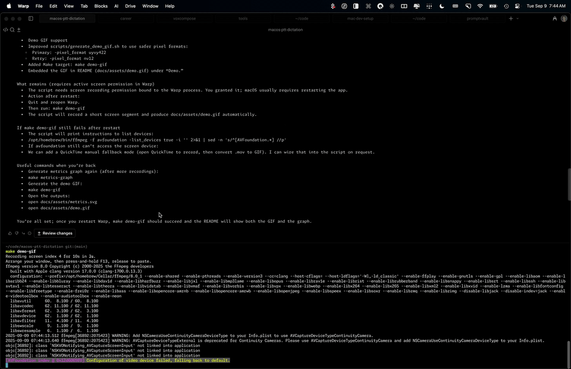

# VoxCore

[](https://github.com/cliffmin/voxcore/actions/workflows/ci.yml) [](https://codecov.io/gh/cliffmin/voxcore) [](LICENSE)  

**Never lose a recording again.** VoxCore transcribes your voice locally, saves every recording, and works everywhere—ChatGPT, Claude, Cursor, Slack, email, anywhere you type. One hotkey. Zero tokens. 4-5x faster than cloud. 100% private.

100% local AI. No tokens, no subscriptions, no compromises.

<!-- Uncomment when demo.gif is generated via: make demo-gif

-->

---

## Universal Voice Infrastructure for the AI Era

**AI tools are exploding.** ChatGPT, Claude, Cursor, Perplexity—you're probably using 3-5 AI apps daily, each with different (or missing) voice input. The bottleneck? Getting your thoughts into AI fast enough.

**But it's not just AI.** Slack messages, emails, documents, code comments—typing everywhere is slow. Voice input is fragmented or missing entirely.

### The Problem: Voice Input is Broken

You're using 3-5 AI apps daily (ChatGPT, Claude, Cursor, Perplexity). Each has different voice input:

- **ChatGPT**: Has voice, but recordings are transient. Cloud fails? Your 5-minute explanation is gone forever.
- **Claude**: No voice at all. Type or use mobile.
- **Cursor**: Has voice, but burns your API tokens. Monthly limit? Can't use voice freely.
- **Perplexity**: Has voice, but cloud-based and recordings lost.
- **Slack, email, docs, Linear, Notion**: No voice input at all.

**The pain:**
- **Lost recordings** - ChatGPT sends to cloud → fails → your work is gone
- **Token costs** - Cursor/Warp burn tokens on transcription instead of AI inference
- **Fragmented experience** - Different behavior in each app, some have no voice
- **Slow performance** - Cloud transcription takes 4-5 seconds vs. <1 second locally

**Result:** You're typing the same prompts over and over, losing recordings to cloud failures, burning tokens on transcription, and dealing with inconsistent voice input across apps.

### Why Voice Matters for AI

**1. Speed of thought**
- Speaking: 150-200 words/minute
- Typing: 40-60 words/minute
- **Voice is 3-4x faster**

**2. Better AI results**
- Verbal explanations include nuance, context, and detail
- More data = better AI responses
- Natural speech captures what typing misses

**3. Iterate faster**
- Quick voice prompts → instant AI feedback
- Rapid iteration = better outcomes
- Essential when you're prompting 20-50 times/day

**4. Reduce friction**
- Hold hotkey, speak, release
- No app switching, no interruption
- Stay in flow state

### VoxCore: Universal Voice Infrastructure

**One hotkey. Every app. Same behavior. Never lose work.**

VoxCore solves the fragmented voice input problem:
- ✅ **Never lose recordings** - Always saves WAV, even if transcription fails
- ✅ **Save tokens** - Transcribe locally, use tokens for AI inference
- ✅ **4-5x faster** - Sub-second vs. 4-5 seconds for cloud
- ✅ **Universal paste** - ChatGPT, Slack, email, docs, anywhere you type
- ✅ **100% private** - Voice never uploaded, 100% on-device
- ✅ **Consistent** - Same workflow, every app, every time
- ✅ **Free forever** - No tokens burned, no rate limits, no subscriptions

### Right Now: Production-Ready Transcription

**VoxCore delivers clean, natural text instantly.** Filler words gone (um, uh), pauses removed, repeat words merged, run-on sentences fixed. What you say becomes readable prose - paste anywhere.

**Perfect timing with AI tool explosion:** ChatGPT, Claude, Cursor, Perplexity, Copilot - you're jumping between 3-5+ AI apps daily. VoxCore lets you speak your prompts 3-4x faster than typing. More verbal context = richer explanations = better AI results. One consistent workflow across all apps.

### Future: Context-Aware Modes (Coming Soon)

Same recording, different output formats:

**AI Prompt Mode** (planned):
```
Optimizes speech for prompt engineering - breaks down speech into structured, focused prompts
Removes redundancy, emphasizes key points, formats for optimal AI understanding

Example:
You say: "So I'm working on this React component and it's not rendering right, I think it might be a state issue but I'm not sure, can you help me debug this?"

AI Prompt Mode outputs:
"React component rendering issue. Suspected state problem. Need debugging help."

Why: Better structured prompts = better AI responses = better outcomes.
```

**Email Mode** (planned):
```
"Hey tell them I can't make the 2pm meeting..."
→ Professional email with proper etiquette
```

**Journal Mode, Meeting Notes, Code Comments** (planned):
- Same voice input, optimized for different contexts
- Always have the original recording

**One hotkey, any output. Choose your mode.**

---

## Why VoxCore?

### 🔒 Your Voice Never Leaves Your Mac
- **100% on-device** - All processing happens locally
- **Zero cloud uploads** - Not "can work offline" but "never uploads, period"
- **Your data, your control** - No company has access to your recordings
- **No AI training on your voice** - Your speech stays private

### ⚡ 4-5x Faster Than Cloud
- **Real-world speed:** 8-second recording: VoxCore <1s, ChatGPT 4-5s
- **Sub-second transcription** - Local processing, no network latency
- **Consistent performance** - No API overhead, no rate limiting, no cloud delays
- **Why it matters:** When prompting 20-50x/day, seconds add up. Faster = less context switching = better flow

### 🛡️ Never Lose Work Again
- **Always saves WAV** - Even if transcription fails, audio is saved
- **Retry anytime** - Re-transcribe from saved WAV if needed
- **Your recordings, forever** - No cloud dependency, no single point of failure
- **Real example:** You spoke a 5-minute explanation to ChatGPT. Cloud error. Recording lost. With VoxCore, the WAV is saved. Retry transcription or listen to the original audio.

### 💰 Save Tokens for What Matters
- **Zero tokens for transcription** - Transcribe locally, save tokens for AI inference
- **Real savings:** If you prompt 50x/day, that's 1,500 transcriptions/month. At $0.01 per transcription, that's $15/month saved. Plus you save tokens for actual AI inference.
- **No rate limits** - Transcribe 1000x/day if you want
- **No subscriptions** - Open source, free forever
- **Unlimited usage** - Really unlimited

### 🌐 One Hotkey. Every App. Same Behavior.
- **Universal paste** - Works in any app where you type (ChatGPT, Claude, Cursor, Slack, email, docs)
- **Consistent quality** - Same transcription behavior everywhere
- **User-tailored** - VoxCompose learns your speech patterns over time
- **Offline-capable** - Planes, trains, anywhere (no internet needed)

## Quick Start

```bash
# Install via Homebrew (recommended)
brew tap cliffmin/tap
brew install --cask hammerspoon
brew install voxcore
voxcore-install

# Grant permissions, then reload Hammerspoon (⌘+⌥+⌃+R)
```

**Use anywhere:**
- Hold `Cmd+Alt+Ctrl+Space` → Speak → Release
- Text pastes at cursor in any app
- Recording saved to `~/Documents/VoiceNotes/`

<details>
<summary>Alternative: Install from source</summary>

```bash
brew install --cask hammerspoon
brew install ffmpeg whisper-cpp openjdk@17
git clone https://github.com/cliffmin/voxcore.git
cd voxcore && ./scripts/setup/install.sh
```
</details>

## The Problem VoxCore Solves

**You're working across multiple AI apps daily** (ChatGPT, Claude, Cursor, Perplexity). Each has different or missing voice input. Some burn your API tokens. Some require internet. None save your recordings.

**You need voice input that:**
- Works the same everywhere
- Doesn't cost tokens
- Works offline
- Saves recordings as backup
- Keeps your voice private

**VoxCore provides universal transcription infrastructure** - one hotkey that works everywhere, with your voice and recordings staying on your Mac.

## Real-World Use Cases

### 1. Privacy-Critical Work
```
Healthcare: Doctor dictating patient notes
Legal: Lawyer recording case strategy  
Business: Executive discussing confidential plans

Concern: HIPAA/confidentiality/trade secrets
VoxCore: Voice never uploaded, fully compliant
```

### 2. AI Power Users: Save Tokens, Use Everywhere
```
Developer: Prompting ChatGPT, Claude, Cursor 50x/day
Problem: 
- Cursor/Warp voice burns API tokens (monthly limit forces rationing)
- Different voice input in each app (or missing entirely)
- Can't use voice freely because it costs money

VoxCore: 
- Same hotkey everywhere (ChatGPT, Claude, Cursor, any app)
- Zero tokens for transcription (save tokens for AI inference)
- 1,500 transcriptions/month = $15/month saved (at $0.01/transcription)
```

### 3. Never Lose Work: The Cloud Failure Problem
```
You: Spoke 5-minute explanation to ChatGPT
ChatGPT: Sends to cloud → Error → Recording lost forever
You: Panic. Under deadline. Can't recreate it.

With VoxCore: WAV always saved. Retry transcription or listen to original audio.
Your work is never lost, even if transcription fails.
```

### 4. Offline Productivity
```
Plane WiFi: Not working
You: Still need to prompt AI
VoxCore: Transcribes locally, works perfectly
```

## How It Compares

| Feature | VoxCore | ChatGPT Voice | Cursor | macOS Dictation |
|---------|---------|---------------|--------|-----------------|
| **Privacy** | ✅ Never uploaded | ❌ Cloud | ❌ API | ⚠️ Cloud |
| **Speed** | ✅ <1s (4-5x faster) | ⚠️ 4-5s | ⚠️ 2-3s | ❌ 3-5s |
| **Works Everywhere** | ✅ Any app | ❌ ChatGPT only | ❌ Cursor only | ✅ Any app |
| **Saves Recording** | ✅ WAV backup | ❌ Transient | ❌ Transient | ❌ No |
| **Offline** | ✅ Yes | ❌ Cloud required | ❌ API required | ❌ Cloud required |
| **Cost** | ✅ $0 | ⚠️ Subscription | ❌ Burns tokens | ✅ Free |
| **Rate Limits** | ✅ None | ⚠️ Has limits | ❌ Token limits | ⚠️ Unknown |

## Recent improvements (quality at same speed)

- New post-processors keep sentences together (no more `the. Project. Vox. Core`) and merge common splits while respecting Vox-family terms (`VoxCore`, `VoxCompose`, `Hammerspoon`, `Whisper`).
- Automated accuracy tests show ~+2% vs 0.4.3 with no added cost; post-processing stays <100 ms, so end-to-end remains <1s for short clips.
- Verify on your data: `scripts/analysis/compare_versions.py -v 0.4.3 0.5.0 --metrics transcription_time duration chars` (uses your recorded set to show speed/quality deltas).

## Core Features

### Universal Transcription
- Works in every app where you can type
- Same hotkey, same workflow, consistent results
- Paste at cursor (ChatGPT, Slack, email, code, anywhere)

### Privacy & Security
- 100% on-device processing (verify with Little Snitch)
- Voice never uploaded to any server
- No telemetry or tracking
- Open source - audit the code
- HIPAA/GDPR-friendly by design

### Reliability
- WAV files always saved (`~/Documents/VoiceNotes/`)
- Can retry transcription if it fails
- Original audio preserved for quality verification
- Never lose work to cloud errors

### Performance
- Sub-second transcription for typical prompts
- Automatic model selection (speed/accuracy balance)
- Smart post-processing (removes "um", "uh", fixes punctuation)
- Often faster than cloud (no network latency)

### Stateless & Fast
- **Algorithmic processing only** - No ML models, no learning, no state
- **Deterministic output** - Same input = same output, always
- **Fast & predictable** - Pure algorithms (word separation, disfluency removal)
- **Optional ML enhancement** - VoxCompose plugin for advanced refinement

### Cost
- Zero API tokens consumed
- No rate limits or usage caps
- No subscriptions or hidden fees
- Free, unlimited, forever

## Where Your Data Lives

```
~/Documents/VoiceNotes/
├── 2025-Nov-15_09.30.00_AM/
│   ├── .version                      ← Version metadata
│   ├── 2025-Nov-15_09.30.00_AM.wav  ← Your recording (yours forever)
│   ├── 2025-Nov-15_09.30.00_AM.txt  ← Transcription
│   └── 2025-Nov-15_09.30.00_AM.json ← Whisper metadata
└── tx_logs/
    └── tx-2025-11-15.jsonl           ← Performance tracking
```

**You own these files:**
- No company has access
- Move/delete/backup as you wish
- Not dependent on any service
- Standard formats (WAV, TXT, JSON)

## Verify Privacy Yourself

```bash
# Install network monitor
brew install --cask little-snitch

# Or use tcpdump
sudo tcpdump -i any

# Use VoxCore and verify: zero network traffic during transcription
```

It's open source - audit the code, verify the claims.

## Documentation

- **[Setup Guide](docs/setup/)** - Installation and configuration
- **[Usage Guide](docs/usage/)** - How to use VoxCore
- **[Performance](docs/performance.md)** - Benchmarks and speed improvements
- **[Configuration](docs/setup/configuration.md)** - Customize behavior
- **[Troubleshooting](docs/setup/troubleshooting.md)** - Common issues
- **[Contributing](CONTRIBUTING.md)** - Development guidelines
- **[Architecture](docs/development/architecture.md)** - System design
- **[Versioning](docs/versioning.md)** - Releases and version management

## FAQ

**Q: Is my voice really never uploaded?**  
A: Correct. All processing is local. Verify with Little Snitch or tcpdump.

**Q: How's the accuracy?**  
A: Whisper-level (~95%+) with smart post-processing for cleanup.

**Q: Does it work offline?**  
A: Yes, 100%. Perfect for planes, trains, anywhere without internet.

**Q: What if transcription fails?**  
A: The WAV file is saved. Retry transcription or listen to the original audio.

**Q: Does it cost anything?**  
A: No. Zero tokens, zero subscriptions. MIT licensed, free forever.

**Q: Will it burn my API tokens?**  
A: No. VoxCore transcribes locally. Save tokens for actual AI inference.

**Q: What about HIPAA/GDPR?**  
A: Compliant by design (voice never leaves your device), but consult your legal team.

**Q: Can I customize the hotkey?**  
A: Yes. Edit `~/.hammerspoon/ptt_config.lua`.

## Roadmap

**Current (v0.4.3):**
- [x] Fast offline transcription (whisper-cpp)
- [x] Universal paste (works everywhere)
- [x] 100% private (never uploads)
- [x] WAV backup (always saved)
- [x] Smart post-processing
- [x] Custom dictionaries
- [x] Version tracking

**Planned:**
- [ ] Multi-mode plugins (journal, email, meeting modes)
- [ ] Quick-switch keybinds for different contexts
- [ ] Enhanced privacy tools (audio encryption)
- [ ] Multi-language optimization

## Plugin Architecture

**VoxCore is designed for extensibility.** The core stays lightweight, fast, and stateless. Advanced features come via opt-in plugins.

### Official Plugin: VoxCompose

[**VoxCompose**](https://github.com/cliffmin/voxcompose) is the official plugin for ML-based refinement (completely optional):

- **Adaptive learning** - Learns from your corrections
- **Context-aware casing** - Technical terms, proper nouns  
- **LLM refinement** - Optional AI-powered cleanup (local Ollama)
- **Stateful processing** - Builds user profile over time

**Install or not?** Your choice. VoxCore works perfectly standalone.

### Future: Community Extensions

Inspired by VS Code's extension marketplace, VoxCore is designed to support community-built plugins:

- **Journal mode** - Transform speech into journal entries
- **Meeting notes** - Structure as meeting minutes
- **Code comments** - Format for inline documentation
- **Custom workflows** - Build your own refinement logic

**Coming soon:** Plugin API and extension marketplace. Stay tuned.

### Why This Architecture?

**VoxCore stays lightweight:**
- Stateless, fast, predictable core
- No forced ML dependencies
- Quick startup, minimal memory

**Plugins add intelligence:**
- Opt-in enhancement (install what you need)
- Independent development and updates
- Community contributions welcome

**You choose your stack:**
- Fast-only: Just VoxCore
- Fast + smart: VoxCore + VoxCompose
- Fast + custom: VoxCore + your plugin

## License

MIT — see [LICENSE](LICENSE)

---

**Fast. Private. Secure. Yours.**

Your voice never leaves your Mac. Your recordings are yours forever.

Built for people who value speed, privacy, and control.
