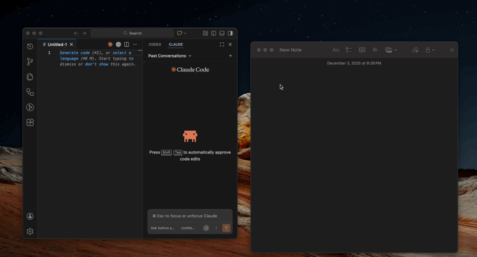
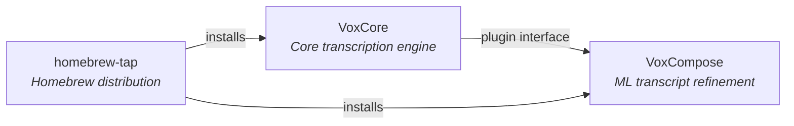

# VoxCore

[](https://github.com/cliffmin/voxcore/actions/workflows/ci.yml) [](https://codecov.io/gh/cliffmin/voxcore) [](LICENSE)  

**Universal voice-to-anything hotkey.** VoxCore captures once and pastes anywhere—ChatGPT, Claude, Cursor, Slack, email—while saving every recording so you never lose work. One hotkey. Zero tokens. Sub-second, on-device, private by default.

Built for AI prompt workflows and cross-app dictation: fast local transcription, WAV backups for reliability, and optional VoxCompose plugin for adaptive refinement when you want LLM polish.

---

## See It In Action



*Hold ⌘+⌥+⌃+Space anywhere → speak → instant transcription at your cursor. Works in every app.*

---

## Why VoxCore?

### ⚡ **Fast as Cloud (Or Faster)**
- **Sub-second transcription** - 8-second recording: VoxCore <1s, ChatGPT 4-5s
- **No network latency** - Local processing, instant results
- **Critical for AI workflows** - When prompting 20-50x/day, seconds add up
- **Consistent performance** - No API overhead, no rate limiting, no cloud delays

### 🛡️ **Never Lose Work Again**
- **Always saves WAV** - Even if transcription fails, audio is saved
- **Your recordings, forever** - No cloud dependency, no single point of failure
- **Real story:** You spoke a 5-minute explanation. Cloud error. Recording lost forever. With VoxCore, the WAV is saved. Retry transcription or listen to the original audio.
- **Reliability + Privacy** - Stored locally = private + reliable

### 💰 **Free Forever**
- **Zero tokens for transcription** - Save tokens for AI inference
- **No subscriptions** - Open source, free forever
- **No rate limits** - Transcribe 1000x/day if you want
- **Real savings:** 1,500 transcriptions/month = $15/month saved (at $0.01/transcription)

### 🧠 **Adapts to You**
- **VoxCompose plugin** - LLM layer that learns your speech patterns
- **More plugins coming** - Journal mode, email mode, meeting notes
- **Extensible architecture** - Community plugins welcome
- **Your choice:** Fast-only (VoxCore) or Fast + Smart (VoxCore + VoxCompose)

### 🎯 **Maximizes AI Prompt Workflows**
- **Works everywhere** - ChatGPT, Claude, Cursor, Slack, email, any app
- **One universal hotkey** - Same workflow, every app, every time
- **3-4x faster than typing** - Speak 150-200 words/min vs type 40-60 words/min
- **Better AI results** - Verbal explanations include nuance and context

### 🔒 **100% Private**
- **Voice never uploaded** - All processing on-device
- **HIPAA/GDPR compliant** - By design, not by policy
- **Open source** - Audit the code, verify the claims
- **Your data, your control** - No company has access

### 🌐 **Works Everywhere**
- **Universal paste** - Any app where you can type
- **Offline capable** - Planes, trains, anywhere (no internet needed)
- **Configurable** - Customize hotkey, behavior, output
- **Simple by default** - Works out of the box, customize if you want

---

## Quick Start

```bash
# Install via Homebrew (recommended)
brew tap cliffmin/tap
brew install --cask hammerspoon
brew install voxcore
voxcore-install

# Grant permissions, then reload Hammerspoon (⌘+⌥+⌃+R)
```

**Use anywhere:**
- Hold `Cmd+Alt+Ctrl+Space` → Speak → Release
- Text pastes at cursor in any app
- Recording saved to `~/Documents/VoiceNotes/`

<details>
<summary>Alternative: Install from source</summary>

```bash
brew install --cask hammerspoon
brew install ffmpeg whisper-cpp openjdk@17
git clone https://github.com/cliffmin/voxcore.git
cd voxcore && ./scripts/setup/install.sh
```
</details>

## Upgrading

```bash
brew update
brew upgrade voxcore
voxcore-install  # Updates Hammerspoon integration
```

After upgrading, reload Hammerspoon (⌘+⌥+⌃+R). Your config and recordings are preserved.

## The Problem VoxCore Solves

**AI tools are exploding.** You're using 3-5 AI apps daily (ChatGPT, Claude, Cursor, Perplexity). Each has different or missing voice input. Some burn API tokens. Some require internet. None save your recordings.

**You've lost recordings to cloud failures.** You spoke a 5-minute explanation. Cloud error. Recording gone forever. Under deadline. Can't recreate it.

**You need voice input that:**
- Works the same everywhere
- Doesn't cost tokens
- Works offline
- **Never loses your recordings**
- Keeps your voice private

**VoxCore provides universal transcription infrastructure** - one hotkey that works everywhere, with your voice and recordings staying on your Mac.

## Real-World Use Cases

### AI Power Users: Save Tokens, Use Everywhere
```
Developer: Prompting ChatGPT, Claude, Cursor 50x/day
Problem: 
- Cursor/Warp voice burns API tokens (monthly limit forces rationing)
- Different voice input in each app (or missing entirely)
- Can't use voice freely because it costs money

VoxCore: 
- Same hotkey everywhere (ChatGPT, Claude, Cursor, any app)
- Zero tokens for transcription (save tokens for AI inference)
- 1,500 transcriptions/month = $15/month saved
```

### Never Lose Work: The Cloud Failure Problem
```
You: Spoke 5-minute explanation to ChatGPT
ChatGPT: Sends to cloud → Error → Recording lost forever
You: Panic. Under deadline. Can't recreate it.

With VoxCore: WAV always saved. Retry transcription or listen to original audio.
Your work is never lost, even if transcription fails.
```

### Privacy-Critical Work
```
Healthcare: Doctor dictating patient notes
Legal: Lawyer recording case strategy  
Business: Executive discussing confidential plans

Concern: HIPAA/confidentiality/trade secrets
VoxCore: Voice never uploaded, fully compliant
```

### Offline Productivity
```
Plane WiFi: Not working
You: Still need to prompt AI
VoxCore: Transcribes locally, works perfectly
```

## How It Compares

| Feature | VoxCore | ChatGPT Voice | Cursor | macOS Dictation |
|---------|---------|---------------|--------|-----------------|
| **Speed** | ✅ <1s (4-5x faster) | ⚠️ 4-5s | ⚠️ 2-3s | ❌ 3-5s |
| **Privacy** | ✅ Never uploaded | ❌ Cloud | ❌ API | ⚠️ Cloud |
| **Works Everywhere** | ✅ Any app | ❌ ChatGPT only | ❌ Cursor only | ✅ Any app |
| **Saves Recording** | ✅ WAV backup | ❌ Transient | ❌ Transient | ❌ No |
| **Offline** | ✅ Yes | ❌ Cloud required | ❌ API required | ❌ Cloud required |
| **Cost** | ✅ $0 | ⚠️ Subscription | ❌ Burns tokens | ✅ Free |
| **Rate Limits** | ✅ None | ⚠️ Has limits | ❌ Token limits | ⚠️ Unknown |

## Recent Improvements

- **Better sentence boundaries** - No more "the. Project. Vox. Core"
- **Improved proper noun handling** - CamelCase compounds preserved correctly
- **~+2% accuracy** vs 0.4.3 with no added cost
- **Sub-second performance** - End-to-end <1s for short clips

## Core Features

### Universal Transcription
- Works in every app where you can type
- Same hotkey, same workflow, consistent results
- Paste at cursor (ChatGPT, Slack, email, code, anywhere)

### Privacy & Security
- 100% on-device processing (verify with Little Snitch)
- Voice never uploaded to any server
- No telemetry or tracking
- Open source - audit the code
- HIPAA/GDPR-friendly by design

### Reliability
- WAV files always saved (`~/Documents/VoiceNotes/`)
- Can retry transcription if it fails
- Original audio preserved for quality verification
- Never lose work to cloud errors

### Performance
- Sub-second transcription for typical prompts
- Automatic model selection (speed/accuracy balance)
- Smart post-processing (removes "um", "uh", fixes punctuation)
- Often faster than cloud (no network latency)

### Plugin Architecture
- **VoxCore** - Fast, stateless, algorithmic core
- **VoxCompose** - Optional LLM layer that adapts to you
- **More plugins coming** - Journal mode, email mode, meeting notes
- **Extensible** - Community plugins welcome

### Cost
- Zero API tokens consumed
- No rate limits or usage caps
- No subscriptions or hidden fees
- Free, unlimited, forever

## Where Your Data Lives

```
~/Documents/VoiceNotes/
├── 2025-Nov-15_09.30.00_AM/
│   ├── .version                      ← Version metadata
│   ├── 2025-Nov-15_09.30.00_AM.wav  ← Your recording (yours forever)
│   ├── 2025-Nov-15_09.30.00_AM.txt  ← Transcription
│   └── 2025-Nov-15_09.30.00_AM.json ← Whisper metadata
└── tx_logs/
    └── tx-2025-11-15.jsonl           ← Performance tracking
```

**You own these files:**
- No company has access
- Move/delete/backup as you wish
- Not dependent on any service
- Standard formats (WAV, TXT, JSON)

## Verify Privacy Yourself

```bash
# Install network monitor
brew install --cask little-snitch

# Or use tcpdump
sudo tcpdump -i any

# Use VoxCore and verify: zero network traffic during transcription
```

It's open source - audit the code, verify the claims.

## Plugin Architecture

**VoxCore is designed for extensibility.** The core stays lightweight, fast, and stateless. Advanced features come via opt-in plugins.

### Official Plugin: VoxCompose

[**VoxCompose**](https://github.com/cliffmin/voxcompose) is the official plugin for ML-based refinement (completely optional):

- **Adaptive learning** - Learns from your corrections
- **Context-aware casing** - Technical terms, proper nouns  
- **LLM refinement** - Optional AI-powered cleanup (local Ollama)
- **Stateful processing** - Builds user profile over time

**Install or not?** Your choice. VoxCore works perfectly standalone.

**See also:** [VoxCompose Integration Guide](https://github.com/cliffmin/voxcompose/blob/main/docs/voxcore-integration.md) for setup instructions.

#### Vocabulary Learning (VoxCompose Only)

**Note:** This feature is **completely optional** and only activates when VoxCompose is installed. VoxCore works perfectly standalone without any vocabulary file.

If you have VoxCompose installed, accuracy improves automatically through vocabulary sharing:

1. **VoxCompose learns** - As you correct transcriptions, VoxCompose learns your technical terms, proper nouns, and speech patterns
2. **Automatic export** - VoxCompose exports learned vocabulary to `~/.config/voxcompose/vocabulary.txt`
3. **VoxCore detects** - VoxCore automatically detects and reads this file (no configuration needed)
4. **Better accuracy** - Whisper transcribes technical terms more accurately with vocabulary hints

**Example improvement (VoxCompose users only):**
- Without vocabulary: "vox core" → "box core" or "vox court"
- With vocabulary: "vox core" → "VoxCore" ✓

**If vocabulary file is missing** (VoxCore standalone users): No problem! VoxCore gracefully falls back to default behavior.

<details>
<summary>Advanced: Manual vocabulary export & configuration</summary>

**Export vocabulary manually:**
```bash
voxcompose --export-vocabulary
```

**Customize vocabulary file location** (optional):
Edit `~/.config/voxcore/config.json`:
```json
{
  "vocabulary_file": "~/custom/path/vocabulary.txt",
  "enable_dynamic_vocab": true
}
```

**Disable vocabulary** (even if file exists):
```json
{
  "enable_dynamic_vocab": false
}
```
</details>

### Future: Community Extensions

Inspired by VS Code's extension marketplace, VoxCore is designed to support community-built plugins:

- **Journal mode** - Transform speech into journal entries
- **Meeting notes** - Structure as meeting minutes
- **Code comments** - Format for inline documentation
- **Custom workflows** - Build your own refinement logic

**Coming soon:** Plugin API and extension marketplace. Stay tuned.

## Ecosystem

VoxCore is the hub of a multi-repo project for local voice-to-text on macOS.



| Repository | Purpose | Status |
|------------|---------|--------|
| **[VoxCore](https://github.com/cliffmin/voxcore)** | Core push-to-talk transcription engine | v0.6.0 |
| **[VoxCompose](https://github.com/cliffmin/voxcompose)** | Optional ML-based transcript refinement via local LLMs | v1.0.0 |
| **[homebrew-tap](https://github.com/cliffmin/homebrew-tap)** | Homebrew formulae for easy installation | Active |

**Architecture:** VoxCore handles recording, transcription (whisper-cpp), and post-processing (Java pipeline). VoxCompose is an optional plugin that adds self-learning corrections and LLM refinement via local Ollama. They communicate through a stdin/stdout plugin protocol, keeping concerns cleanly separated.

## Documentation

- **[Setup Guide](docs/setup/)** - Installation and configuration
- **[Usage Guide](docs/usage/)** - How to use VoxCore
- **[Performance](docs/performance.md)** - Benchmarks and speed improvements
- **[Configuration](docs/setup/configuration.md)** - Customize behavior
- **[Troubleshooting](docs/setup/troubleshooting.md)** - Common issues
- **[Contributing](CONTRIBUTING.md)** - Development guidelines
- **[Architecture](docs/development/architecture.md)** - System design
- **[Versioning](docs/development/versioning.md)** - Releases and version management
- **[Release Guide](docs/development/release.md)** - Complete release process

## FAQ

**Q: Is my voice really never uploaded?**  
A: Correct. All processing is local. Verify with Little Snitch or tcpdump.

**Q: How's the accuracy?**  
A: Whisper-level (~95%+) with smart post-processing for cleanup.

**Q: Does it work offline?**  
A: Yes, 100%. Perfect for planes, trains, anywhere without internet.

**Q: What if transcription fails?**  
A: The WAV file is saved. Retry transcription or listen to the original audio.

**Q: Does it cost anything?**  
A: No. Zero tokens, zero subscriptions. MIT licensed, free forever.

**Q: Will it burn my API tokens?**  
A: No. VoxCore transcribes locally. Save tokens for actual AI inference.

**Q: What about HIPAA/GDPR?**  
A: Compliant by design (voice never leaves your device), but consult your legal team.

**Q: Can I customize the hotkey?**  
A: Yes. Edit `~/.hammerspoon/ptt_config.lua`.

## Roadmap

**Current (v0.6.0):**
- [x] Fast offline transcription (whisper-cpp)
- [x] Universal paste (works everywhere)
- [x] 100% private (never uploads)
- [x] WAV backup (always saved)
- [x] Smart post-processing (Java pipeline)
- [x] Custom dictionaries and vocabulary
- [x] Version tracking and performance analysis
- [x] Plugin architecture (VoxCompose integration)
- [x] Standalone CLI (`voxcore transcribe`)

**Next (v0.7.0):**
- [ ] Robust audio device detection (name-based, handles macOS Continuity)
- [ ] Streaming transcription (real-time feedback)
- [ ] Enhanced vocabulary learning from corrections

**Future:**
- [ ] Multi-mode plugins (journal, email, meeting modes)
- [ ] Quick-switch keybinds for different contexts
- [ ] Multi-language optimization
- [ ] Linux support (currently macOS only)
- [ ] Plugin marketplace

## License

MIT — see [LICENSE](LICENSE)

---

**Fast. Private. Secure. Yours.**

Your voice never leaves your Mac. Your recordings are yours forever.

Built for people who value speed, privacy, and control.
